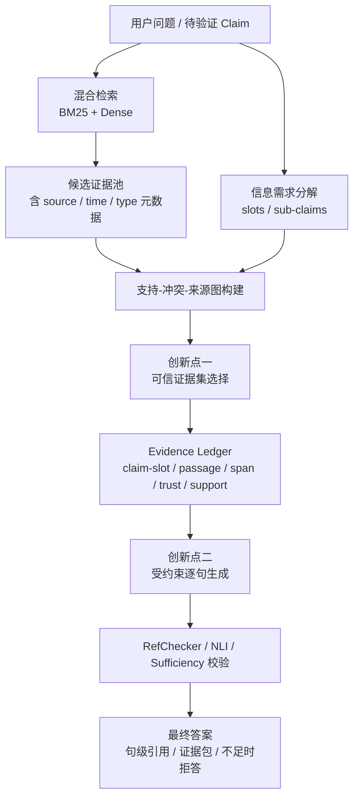
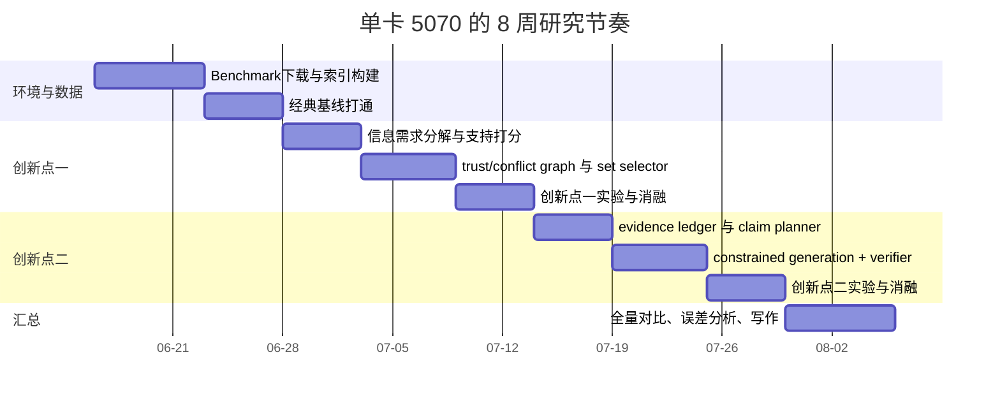

# 面向证据集合与证据约束生成的 RAG 工程化研究路径

## 执行摘要

结合你当前项目“需要让答案**尽量完整地覆盖证据、处理多源不一致、识别可信来源，并让生成结果严格受证据约束**”的目标，最适合走的不是“大而全”的端到端重训练路线，而是两条**小而硬、可在单卡 RTX 5070 上推进**的工程化支线：其一是做**预算感知的可信证据集选择**，把“top-k 重排”升级为“证据集合优化”；其二是做**证据账本驱动的受约束生成**，把“先回答、后补引用”升级为“先对齐证据、再逐句生成”。这两条路线分别对应近两年的核心趋势：SetR 证明了传统 rerank 难以保证复杂问题所需的“集合完整性”；RA-RAG、RAMDocs、TruthfulRAG 说明来源可靠性和冲突证据会显著影响最终回答；ReClaim、ALCE、RefChecker、RAGChecker 则提供了“句级归因、支持性检查、系统级诊断”的可复用评测框架。citeturn10view5turn10view3turn27view2turn27view3turn25search0turn18search0turn30search0turn29search0

如果直接用公开 benchmark 起步，建议优先把任务拆成两个实验包：**创新点一**使用 HoVer、EX-FEVER、FEVER、RAMDocs，分别覆盖多跳证据抽取、解释路径、多证据验证、冲突来源与误信息；**创新点二**使用 ASQA、ExpertQA、Qasper，并以 REASONS 做句级引用精度补充。这样做的原因是，这些数据集都比 NQ/TriviaQA 更适合衡量“证据是否够全、是否一致、是否真支持生成内容”；而 NQ、TriviaQA、OR-QuAC、WebQA 更适合做次级泛化或检索 sanity check，而不是你这两项创新的首发主战场。citeturn21view1turn24view0turn21view0turn27view1turn21view8turn21view9turn21view2turn20search2turn21view3turn21view4turn21view5turn21view6

## 总体研究路径与系统架构

这条研究路径建议采用“**公开 benchmark 做方法验证，项目域小样本做迁移检查**”的两阶段方式。第一阶段只解决系统方法问题，不急着做行业专有数据；第二阶段再把方法迁移到你的项目场景里，用少量人工标注问题验证是否对“应急预案、风险点、来源可信级别、责任链条”同样有效。这样既能保证论文对标公开基准，又能让最终方案回到你的系统工程主线。SetR、SEER、TRACE、Sufficient Context、RAGChecker 都表明，RAG 的瓶颈常常不是“生成器不够强”，而是**证据选得不全、上下文不够用、证据虽在但模型未被约束使用**。citeturn10view5turn10view4turn10view6turn28search2turn29search0

从工程顺序看，最稳妥的落地方式是先做**检索端集合优化**，再做**生成端证据约束**。原因很简单：如果证据集合本身不完整，再强的约束生成也只会“忠实地输出不完整答案”；反过来，如果证据已经较完整而生成仍然漂移，就更容易把收益明确归因到生成约束模块。citeturn10view5turn28search2turn25search0

## 创新点一

### 预算感知的可信证据集选择

#### 问题定义

现有 RAG 工程里最常见的做法是“先检索 top-k，再 rerank，最后把前几段喂给 LLM”。这在单跳问答里常常够用，但在**多跳、长答案、冲突来源**场景中会出现三个关键问题：第一，单段相关不代表**集合完整**；第二，多个高分段落之间可能相互冗余，浪费 token 预算；第三，相关但**低可信来源**或彼此冲突的内容会混入上下文，导致回答虽然“有依据”，却不是“可信且一致的依据”。SetR 对第一个问题给出了直接证据，RA-RAG 和 RAMDocs 则分别指出来源可靠性与冲突证据是标准 RAG 会忽略的维度。citeturn10view5turn10view3turn27view2

#### 技术思路

建议把这项创新做成一个**训练轻量、偏系统优化**的模块，而不是复现一个完整的大模型 reranker。核心做法是：先把问题分解为若干**信息需求槽位**，再在候选证据池上做一个带约束的集合选择。每个候选段落不只看“和 query 是否相关”，还要看它对哪些槽位提供支持、它与已选段落是否互补、其来源是否可信、是否与已选证据冲突，以及它占用多少 token。最终目标不是挑“最相关的若干段”，而是在给定预算内选出**最完整、最一致、最可信**的一组证据。这个方向直接承接 SetR 的 set-wise 思路，但把它进一步工程化为**可解释的显式打分与约束优化**；在来源端则借鉴 RA-RAG 的 reliability-aware 思路；在一致性端可参考 TruthfulRAG 与 FaithfulRAG 的冲突建模视角，但只保留最轻量的 NLI/claim-level 冲突检测，不走图谱重建或大规模训练。citeturn10view5turn10view3turn27view3turn15search0

一个实用的打分形式可以写成：

\[
\mathrm{Score}(S)=\alpha \cdot \mathrm{Coverage}(S) + \beta \cdot \mathrm{Trust}(S)+\gamma \cdot \mathrm{Novelty}(S)-\delta \cdot \mathrm{Conflict}(S)-\lambda \cdot \mathrm{Cost}(S)
\]

其中 `Coverage` 衡量对信息槽位的覆盖，`Trust` 来自来源可信度与跨源一致性，`Novelty` 抑制冗余，`Conflict` 惩罚互相矛盾证据，`Cost` 则控制 token 预算。这个式子非常适合工程实现，因为每一项都能单独做 ablation，也容易在论文里解释。citeturn10view5turn10view3turn27view1

#### 具体实现步骤

建议按下面的顺序实现，避免一开始就陷入复杂训练：

| 步骤 | 实现要点 |
|---|---|
| 候选检索 | 用 BM25 + dense 双路取 top-50 或 top-100，保留 source、title、time、doc_type 等元数据 |
| 信息需求分解 | 把问题分解成 2-6 个 slots；在 FEVER/HoVer 中可直接近似为证据 hop，在长答案任务中可分解为子问题/关键 claim |
| 段落支持评分 | 用轻量 cross-encoder 或 NLI 估计 passage 对各 slot 的支持度 |
| 来源可信评分 | 结合 source 先验、跨源一致性、doc_type；在 RAMDocs 中可直接利用 `correct/misinfo/noise` 弱标签 |
| 冲突惩罚 | 对候选段两两做句级或段级 contradiction 检测，构建 conflict graph |
| 集合优化 | 用 greedy submodular、budgeted maximum coverage 或 0-1 ILP 选集合 |
| 输出证据账本 | 记录每个 slot 对应的段落 ID、source、support 分数、trust 分数、冲突标记 |

实现层面完全可以只用 Python + FAISS/Pyserini + sentence-transformers + 一个轻量 NLI/checker，不需要先训练大 reranker。SetR 的公开实现基于 Llama 3.1 8B 训练，适合对比，但不适合作为你单卡 5070 的第一步复现目标。citeturn23view0turn8search0turn19search6turn19search0

#### 所需模型与公开 baseline

这条创新最应该比较的 baseline 不是“更大的生成器”，而是**不同的证据选择方式**。建议至少保留这五类基线：朴素 BM25+LLM、DPR top-k、BM25+cross-encoder rerank、SetR、RA-RAG。RAG、REALM、DPR、FiD 本身也值得保留在总表中，用来说明你的方法是在经典 RAG 管线上做**证据集合级别升级**。这些系统都已有公开论文或实现。citeturn7search15turn7search1turn7search2turn31search12turn10view5turn27view0

#### 数据集与 benchmark

这项创新最适合放在以下公开数据上：

| 优先级 | Benchmark | 适合原因 |
|---|---|---|
| 高 | HoVer citeturn21view1 | 多跳证据抽取，天然考察集合完整性 |
| 高 | EX-FEVER citeturn24view0 | 有解释路径，适合做 evidence path / explainability |
| 高 | FEVER citeturn21view0 | 快速迭代，适合先做 evidence recall 与 label accuracy |
| 高 | RAMDocs citeturn27view1turn27view2 | 直接考察冲突证据、误信息、歧义来源 |
| 中 | Qasper citeturn21view2 | 长文档、多证据、支持答案的 evidence spans |
| 中 | CRUD-RAG 读任务子集 citeturn17search1turn21view10 | 中文补充，适合作为系统迁移检查 |
| 低 | NQ / TriviaQA citeturn3search1turn21view4 | 有助于 answer accuracy，但对“集合完整性”监督较弱 |

推荐顺序是：先 FEVER 打通管线，再 HoVer/EX-FEVER 做主结果，最后 RAMDocs 做“可信来源与冲突处理”的补充主结果。这样实验成本低，论文叙事也完整。citeturn21view0turn21view1turn24view0turn27view2

#### 评估指标、实验设计、预期结果与风险

评估不应只看 answer EM/F1。建议把指标分成五组：**准确率**（EM/F1/label accuracy）、**证据覆盖**（gold evidence recall、set completeness@budget）、**证据一致性**（selected-set contradiction rate、cross-source agreement）、**可解释性**（evidence path match、slot coverage、用户可审计 ledger 完整度）、**资源消耗**（平均检索时延、重排时延、token budget、峰值显存）。RAGChecker 可以用来做系统级诊断，RefChecker 则适合做 claim-level 支持性复核。citeturn29search0turn30search0

实验设计上，建议做四类对比：其一，对比不同选择策略；其二，做预算实验，看在固定 512/1024/1536 token 预算下谁的 evidence recall 更高；其三，做 ablation，分别去掉 query decomposition、trust prior、conflict penalty；其四，在 RAMDocs 上做 source-noise 强度敏感性分析。预期上，这个模块最容易拿到的不是 answer accuracy 的巨大跃升，而是**evidence recall、coverage、conflict suppression** 的稳定提升；比较现实的目标是相对 top-k/rerank 取得 **+4 到 +8 的证据召回改进、+1 到 +3 的最终准确率改进、以及明显更低的冲突率**。主要风险在于：如果最初检索召回太低，集合优化没有上限空间；如果来源可靠性 benchmark 不统一，则需要在 RAMDocs 与合成 source-tier 上分开报告。citeturn10view5turn10view3turn27view2turn28search2

## 创新点二

### 证据账本驱动的严格受约束生成

#### 问题定义

即使检索到了好的证据，标准 RAG 仍然经常出现“**答案看似引用了来源，但具体句子并不被证据支持**”的问题。ALCE 把这件事正式变成了 benchmark；ReClaim 进一步证明，句级引用比段落级引用更容易核验；RefChecker 和 RAGChecker 也都指出，需要在 claim 级别而不是 response 级别检查支持关系。对你的项目来说，这比“能否生成更长的答案”更重要，因为工程系统最终需要的是**可审计回答**，而不是“看起来很像正确答案”的文字。citeturn18search0turn25search0turn30search0turn29search0

#### 技术思路

这项创新建议做成一个**不依赖大规模微调、以推理时约束为主**的“证据账本生成器”。核心思想是把回答过程拆成三步：先基于选定证据生成一个**claim plan**；然后为每个 claim 绑定 1-2 个最强支持句，形成 evidence ledger；最后让生成器只能围绕这些证据逐句作答，并在句尾输出 citation。若某个 claim 找不到足够支持，就改写为不确定表达或直接拒答。这个思路与 ReClaim 的“交替生成引用与 claim”高度一致，但比直接复现 ReClaim 更轻，因为你可以先做**prompt-only + verifier** 版本，把 LoRA 微调放到第二阶段。与此同时，它又比单纯 ALCE-style prompting 更严格，因为你的生成输入已经被前一个模块压缩成“少量、高置信、成组”的证据，而不是一长串 top-k passages。citeturn25search0turn18search0turn10view5

#### 具体实现步骤

这项创新建议直接做成一个可插拔的后处理/生成模块：

| 步骤 | 实现要点 |
|---|---|
| Claim 规划 | 先生成回答提纲或句级 claims，避免一次性长文本自由生成 |
| Span 绑定 | 对每个 claim 从 evidence set 中选 1-2 个支持句，写入 ledger |
| 受约束生成 | 仅给模型 claim + 支持句 + citation 模板，禁止再访问完整候选池 |
| 支持性校验 | 用 RefChecker/NLI 判断 claim 是否被绑定证据支持 |
| 纠错或拒答 | 对 unsupported claim 触发 rewrite / drop / abstain |
| 输出格式 | “句子 + citation + source metadata”，并保留 ledger 便于审计 |

如果你希望把这项工作写得更像“系统论文”而不是“prompt 工程”，关键就在于把 ledger 设计清楚：`claim_id`, `slot_id`, `source_id`, `passage_id`, `sentence_span`, `trust_score`, `support_score`, `checked_flag`。这样系统会天然具备**证据归因、责任追踪、可解释性审计**能力。citeturn25search0turn30search0turn29search0

#### 所需模型与公开 baseline

这项创新适合比较的 baseline 是：Vanilla RAG、ALCE baseline、Self-RAG、ReClaim，以及在冲突场景下的 FaithfulRAG 或 TruthfulRAG。你的方法与它们的差异应明确写成：**不追求更强生成器，而追求“claim 必须被 ledger 支持”这一强约束**。Self-RAG 强在自反思与动态检索，ReClaim 强在句级 attribution，FaithfulRAG/TruthfulRAG 强在处理 parametric knowledge 与外部证据冲突；你的创新则把这些目标收敛成一个**更轻、更可复现、更适合单卡系统实验**的流程。citeturn13search2turn13search3turn25search0turn15search0turn27view3

#### 数据集与 benchmark

这项创新应优先使用下列公开数据：

| 优先级 | Benchmark | 适合原因 |
|---|---|---|
| 高 | ASQA / ALCE citeturn21view8turn18search11 | 长答案正确性 + 自动 citation 评测成熟 |
| 高 | ExpertQA citeturn21view9turn12search4 | 有专家审核的 factuality / attribution 轴 |
| 高 | Qasper citeturn21view2 | 长文证据、答案与 supporting evidence 绑定明确 |
| 中 | REASONS citeturn20search1turn20search2 | 句级检索与自动引用，可测 citation 精度 |
| 中 | RAMDocs citeturn27view2 | 测“证据不足时是否拒答”与“冲突时是否过度生成” |
| 低 | ELI5 citeturn21view7turn12search8 | 任务经典但数据获取链路相对麻烦，建议只做补充 |

如果你只想要最短工程路径，建议直接选 **ASQA + ExpertQA + Qasper**。这是兼顾可复现、句级归因、长答案质量的最快组合。citeturn21view8turn21view9turn21view2

#### 评估指标、实验设计、预期结果与风险

这项创新至少要报告五组指标：**准确率**（QA accuracy、EM、任务自带 F1）、**证据覆盖**（每句/每 claim 是否有支持 citation）、**证据一致性**（unsupported claim rate、citation contradiction rate）、**可解释性**（citation precision/recall、ALCE 指标、ledger 完整率）、**资源消耗**（生成时延、输出 token、校验开销）。其中，RAGChecker 适合做系统诊断，RefChecker 适合严格判断“这句话到底有没有被支持”，Sufficient Context 的思想则很适合加入一个“证据不足时应拒答”的 selective generation 指标。citeturn29search0turn30search0turn28search2

实验上建议做三层递进：第一层是 prompt-only，对比 Vanilla RAG 与 ledger-constrained generation；第二层加入 verifier，对 unsupported claim 做 rewrite/drop；第三层若资源允许，再做一个很小的 LoRA 版本，把 ASQA/Qasper/自造格式化样本用于 3B-7B 模型的短程 SFT。预期收益通常会体现为：**citation precision 与 claim support 显著上升，unsupported claim rate 明显下降，答案长度更紧凑**；准确率可能小幅提升，也可能在极严格约束下略有回落，但这在可信系统论文里通常是可以接受的权衡。主要风险是：约束太强会过度保守，导致答案不够流畅或信息量下降；另外，若证据只“语义支持”而非“字面支持”，自动 checker 可能偏严。citeturn25search0turn18search0turn30search0turn28search2

## 基线、benchmark 与评测的最小可复现组合

从工程投入与论文收益比看，你不需要一次性跑完所有流派。下面这组组合已经足够形成一篇“系统化、有创新、有公开对比”的研究路径。表中的方法与数据都已有公开论文或实现。citeturn7search15turn7search1turn7search2turn31search12turn10view5turn27view0turn13search3turn18search11turn25search4

| 类别 | 最低应比较对象 | 作用 |
|---|---|---|
| 经典基线 | RAG / REALM / DPR / FiD | 说明你没有绕开经典 RAG 管线 |
| 证据选择基线 | BM25+LLM / BM25+rerank / SetR / RA-RAG | 对比“相关性排序”与“集合优化/来源可靠性” |
| 证据约束生成基线 | Vanilla RAG / ALCE prompting / Self-RAG / ReClaim | 对比“自由生成”与“句级证据约束” |
| 冲突鲁棒基线 | FaithfulRAG 或 TruthfulRAG | 对比冲突知识场景下的 faithfulness |

对 benchmark 的取舍，建议采用下面这个“主任务 + 补任务”的组合：主任务确保论文主结论清楚，补任务用来说明方法并非只在单一语料上有效。citeturn21view0turn21view1turn24view0turn27view1turn21view8turn21view9turn21view2turn17search1

| 目标 | 主 benchmark | 补 benchmark |
|---|---|---|
| 证据集合完整性 | HoVer, EX-FEVER | FEVER, Qasper |
| 可信来源与冲突抑制 | RAMDocs | RA-RAG 论文配套数据脚本或合成 source-tier |
| 严格证据约束生成 | ASQA, ExpertQA | Qasper, REASONS |
| 中文迁移检查 | CRUD-RAG 读任务子集 | 你项目内少量人工标注样本 |

为了让论文更“系统”，建议统一报告以下指标：任务准确率、gold evidence recall/precision/F1、citation precision/recall、unsupported claim rate、context sufficiency/abstention 成功率、平均 token 成本、平均时延、峰值显存。RAGChecker 与 RefChecker 可以减少你自己重新发明指标的工作量。citeturn29search0turn30search0turn28search2

## 单卡可行性、资源估算与实验时间线

NVIDIA 官方规格显示，桌面版 RTX 5070 标准显存为 **12GB**；而 Hugging Face 的 bitsandbytes 与 PEFT 官方文档都明确支持 4-bit 量化与参数高效微调，用于显著降低推理和微调内存成本。因此，对你这类研究，**“索引优化 + 推理时约束”是最稳妥主线；小规模 LoRA 是可选增强，而不是起步必需品**。citeturn19search3turn19search0turn19search4turn19search6turn19search2

### 工程资源估算

| 实验模式 | GPU 显存 | GPU 小时 | 存储 | 说明 |
|---|---:|---:|---:|---|
| 模式一：纯推理/索引优化 | 6-10GB | 0-4h | 10-30GB | 最推荐；足够完成两项创新主体 |
| 模式二：检索器小校准 | 8-12GB | 4-10h | 15-35GB | 可训练轻量 reranker / reliability calibrator |
| 模式三：3B-7B QLoRA 小微调 | 10-12GB | 8-20h | 20-50GB | 只建议用于创新点二的格式学习 |
| 不建议：完整复现 SetR/ReClaim 8B 训练 | 往往超 12GB 安全边界 | 20h+ | 50GB+ | 更适合多卡或更大显存环境 |

一个很现实的做法是：**创新点一完全不训练，只做检索、graph scoring、submodular selection；创新点二先做 prompt-only + verifier，再视结果决定是否做 3B/7B LoRA。** 这条路线最符合你“资源友好、工程可复现”的目标。SetR 官方实现直接使用 Llama 3.1 8B 训练脚本，也从侧面说明 full reproduction 并不适合把 5070 当作默认配置。citeturn23view0turn19search0turn19search6

### 创新点与基线的工程对比

下表是面向论文叙事的建议对比维度，数值区间是工程预期而非文献原始结果。其目的不是承诺 SOTA，而是提前明确“你的方法应该赢在哪里”。相关 baseline 来自公开论文与实现。citeturn10view5turn27view0turn25search0turn13search3turn31search2turn31search12

| 方法 | 主要改进点 | 预期收益重点 | 实现复杂度 | 5070 友好度 | 可解释性 |
|---|---|---|---|---|---|
| BM25+LLM | 稀疏检索 + 直接生成 | 快速、便宜 | 低 | 很高 | 低 |
| DPR / FiD | 强化检索或多文档融合 | answer accuracy | 中 | 中 | 中 |
| SetR | 集合级选择 | evidence completeness | 中高 | 中低 | 中高 |
| RA-RAG | 来源可靠性建模 | trusted-source hit / robustness | 中 | 中 | 中高 |
| Self-RAG | 自反思与动态检索 | factuality / adaptive retrieval | 中高 | 中 | 中 |
| ReClaim | 句级引用生成 | citation precision / support | 高 | 中低 | 高 |
| 你的创新点一 | 预算感知可信证据集选择 | evidence recall / consistency / trust | 中 | 高 | 高 |
| 你的创新点二 | ledger 驱动受约束生成 | unsupported claim 降低 / attribution | 中 | 高 | 很高 |

### 实验时间线

关键里程碑建议设为四个：**第一周结束**完成 benchmark 与 baseline 打通；**第三周结束**拿到创新点一在 FEVER/HoVer 上的 evidence recall 结果；**第五到六周**完成创新点二的 citation / support 指标；**第八周**完成总表、案例分析、风险讨论。citeturn21view0turn21view1turn21view8turn21view9turn29search0

## 近两年优先论文清单与批注

下面这份清单优先保留了 2024-2026 年、与你两项创新直接相关的论文。ACL、EMNLP、NeurIPS、ICLR、AAAI 等 CCF A 会议占多数；少数 OpenReview/arXiv 工作是因为它们的数据集或评测工具已经足够工程可用。citeturn10view5turn10view4turn10view6turn10view3turn25search0turn15search0turn27view3turn27view2turn28search2turn29search0turn30search0turn24view0turn26search0

### 优先参考论文

1. **Shifting from Ranking to Set Selection for Retrieval Augmented Generation**，ACL 2025。核心价值是把 passage rerank 改为 set-wise selection，直接对应你“证据集合完整性”的主问题。citeturn10view5
2. **SEER: Self-Aligned Evidence Extraction for Retrieval-Augmented Generation**，EMNLP 2024。强调 evidence extraction 的可学性与质量偏好建模，适合借鉴为你的 support 打分器。citeturn10view4
3. **TRACE the Evidence: Constructing Knowledge-Grounded Reasoning Chains for Retrieval-Augmented Generation**，Findings of EMNLP 2024。把多文档证据融合为 reasoning chain，适合借鉴到 evidence ledger 或 slot path。citeturn10view6
4. **Retrieval-Augmented Generation with Estimation of Source Reliability**，EMNLP 2025。直接解决多源可靠性估计，是你“可信来源判定”的最贴近基线。citeturn10view3turn27view0
5. **Ground Every Sentence: Improving Retrieval-Augmented LLMs with Interleaved Reference-Claim Generation**，Findings of NAACL 2025。直接对标你的第二项创新，尤其适合借它的句级 citation 格式。citeturn25search0turn25search4
6. **Towards Improved Multi-Source Attribution for Long-Form Answer Generation**，NAACL 2024。关注多源 attribution，适合做长答案归因的技术与评测参考。citeturn9search2
7. **FaithfulRAG: Fact-Level Conflict Modeling for Context-Faithful Retrieval-Augmented Generation**，ACL 2025。适合作为冲突证据条件下的强 faithfulness baseline。citeturn15search0turn15search2
8. **TruthfulRAG: Resolving Factual-level Conflicts in Retrieval-Augmented Generation with Knowledge Graphs**，AAAI 2026。适合你在论文 related work 中说明“冲突建模”的最新进展。citeturn27view3turn16search7
9. **Retrieval-Augmented Generation with Conflicting Evidence**，COLM 2025。提供 RAMDocs 数据与 MADAM-RAG 框架，是“冲突来源与误信息”最实用的 benchmark。citeturn27view2turn27view1
10. **Sufficient Context: A New Lens on Retrieval Augmented Generation Systems**，ICLR 2025。非常适合把“证据不足时拒答”纳入你的系统评测。citeturn28search2turn28search4
11. **RAGChecker: A Fine-grained Framework for Diagnosing Retrieval-Augmented Generation**，NeurIPS 2024 Datasets & Benchmarks。建议直接作为总评测工具之一。citeturn29search0turn29search1
12. **RefChecker: Reference-based Fine-grained Hallucination Checker and Benchmark for Large Language Models**，2024。建议直接作为 claim-level 支持性检查器。citeturn30search0turn30search1
13. **EX-FEVER: A Dataset for Multi-hop Explainable Fact Verification**，Findings of ACL 2024。非常适合支撑 explainability 与 reasoning path 的实验。citeturn24view0
14. **VISA: Retrieval Augmented Generation with Visual Source Attribution**，ACL 2025。如果后续你的项目要做 PDF/图表/文档溯源，这篇很值得跟进。citeturn26search0

### 五篇最值得精读的批注

**SetR** 的最大可借鉴点，不是它用了更大的 LLM，而是它把“好检索”重新定义为“满足信息需求的证据集”，这正好能为你的创新点一建立理论支点。你不必复现它的完整训练流程，只需把它的 set-wise 思想改写成“显式 coverage + trust + conflict”的轻量优化器即可。citeturn10view5turn23view0

**RA-RAG** 最值得借鉴的是“来源可靠性不是检索后的附属属性，而应进入检索与聚合目标函数”。如果你的 benchmark 没有天然 source reliability 标签，可以用 RAMDocs 的 `correct/misinfo/noise` 先验证机制成立，再迁移回项目域。citeturn10view3turn27view0turn27view1

**ReClaim** 最值得借鉴的是输出格式，而不是它的全套训练。它把回答拆成 reference 与 claim 交替生成，这个思想非常适合你做轻量版 ledger-constrained generation：你甚至可以先不用训练，只在推理阶段强制“先证据、后句子”。citeturn25search0turn25search4

**Sufficient Context** 最值得借鉴的是评测观，而不是模型结构。它提醒你：很多错误并不是模型不会答，而是上下文本身不够。把“context sufficiency / guided abstention”纳入指标后，你的论文会从“提升准确率”升级为“提升可信决策行为”。citeturn28search2turn28search4

**RAGChecker 与 RefChecker** 最值得借鉴的是“不要只报一个最终分数”。如果你同时报告 retrieval-side、claim-side、citation-side、unsupported-rate、latency，那么论文会非常像系统研究，而不是普通 prompt 试验。citeturn29search0turn30search0

## 结论性的实施清单

如果你准备下周就开做，最短路径可以直接写成以下实施清单：先做 **FEVER → HoVer → EX-FEVER → RAMDocs** 的证据集合实验，完成创新点一；再做 **ASQA → ExpertQA → Qasper** 的 ledger-constrained generation，完成创新点二；评测统一用 **RAGChecker + RefChecker + benchmark 原生指标**；本地生成器先用 4-bit 量化的 3B-7B instruct 模型，只在最后决定是否加小规模 LoRA；中文与项目迁移只做 **CRUD-RAG 读任务子集 + 你自己项目的少量人工样本**。这条路线对公开 benchmark、工程资源、论文叙事和系统落地性之间的平衡最好。citeturn21view0turn21view1turn24view0turn27view2turn21view8turn21view9turn21view2turn29search0turn30search0turn17search1turn19search3turn19search0turn19search6
