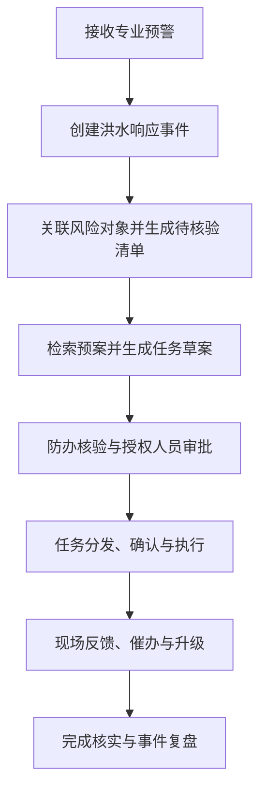
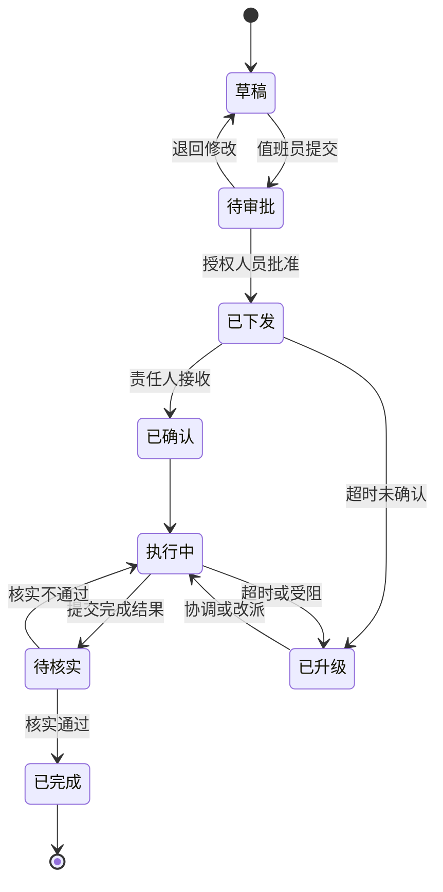

# 基于多源时空语义关联与 FRC-RAG 的洪水预警响应系统——V3 设计说明

> 文档状态：现行产品定位与业务设计说明；具体迭代、门禁和完成边界以《洪水预警响应系统_渐进式迭代开发与升级设计》及验收审计为准。
> 系统主线：专业预警输入 → 风险对象筛查 → 任务草案生成 → 人工审批 → 部门执行 → 反馈核实 → 事件复盘。
> 核心原则：确定性业务流程为主，RAG 与智能体提供辅助，正式判断和高风险任务必须由授权人员审批。

---

## 1. 系统名称与定位

### 1.1 建议名称

**基于多源时空语义关联与 FRC-RAG 的洪水预警响应系统**

论文题目可使用：

> **基于多源时空语义关联与 FRC-RAG 的洪水预警响应任务闭环系统设计与实现**

### 1.2 一句话定位

系统面向区县防汛抗旱指挥部办公室，在专业部门已经发布洪水、暴雨或水情预警后，辅助防办形成待核验风险对象清单和结构化处置任务，经人工审批后分发至责任岗位，并持续记录确认、执行、反馈、升级和复盘过程。

### 1.3 系统解决的问题

现有气象、水利、水文、住建等专业系统主要提供预报、预警和监测信息。区县防办收到这些信息后，仍需人工完成四项转换：

1. **预警信息 → 风险对象**：判断哪些隧道、养老机构、学校、社区等对象可能受影响；
2. **预案条款 → 处置任务**：从预案中提取触发条件、责任岗位、处置动作和流程；
3. **工作部署 → 部门执行**：经过审批后向成员单位及基层责任人分发任务；
4. **现场反馈 → 核实复盘**：跟踪任务确认、执行、受阻、完成和升级过程。

### 1.4 系统边界

系统明确不承担以下职责：

- 不替代气象、水利、水文等专业模型开展洪水预测；
- 不自动发布正式预警；
- 不替代防指领导作出行政决策；
- 不允许大模型绕过人工审批直接下发高风险任务；
- 不承诺解决完全断电、断网情况下的通信问题；
- 不将未经核实的群众或网络信息直接作为正式决策依据。

系统适用前提是：**专业预警已经产生，基本通信条件可用，区县防办需要组织后续响应。**

---

## 2. 研究背景与升级必要性

### 2.1 灾害损失与现实需求

2025 年，全国洪涝和地质灾害造成 568 人死亡失踪、直接经济损失 1665.76 亿元，分别占全部自然灾害死亡失踪人数和直接经济损失的 74% 与 69%。洪涝灾害防御不仅需要继续提高监测预警能力，也需要提高预警发布后的组织响应效率。

### 2.2 典型案例反映的业务问题

#### 河南郑州“7·20”特大暴雨

调查报告指出，气象部门多次发布暴雨红色预警，但应急响应启动和刚性行动明显滞后，暴露出专业预警与应急行动衔接不足的问题。

#### 北京密云太师屯镇养老照料中心“7·28”事件

北京市已经对密云区启动防汛一级响应，但养老照料中心未被纳入事前转移范围；部分预警信息主要停留在转发层面，没有形成面向该机构的具体转移任务；现场进水后，处置措施和报警升级也不够及时。

上述案例共同说明：

> 有预警或有响应，不等于重点对象已经进入行动清单，也不等于任务已经落实到具体岗位。

### 2.3 系统升级的核心方向

系统升级不再追求覆盖整个“监测—预测—预警—救援”链条，而是聚焦区县防办预警响应阶段，重点建设：

- 风险对象清单；
- 结构化任务卡；
- 人工审批流程；
- 多岗位任务协同；
- 反馈核实与超时升级；
- 全过程事件台账。

---

## 3. 服务部门与用户岗位

### 3.1 核心服务部门

系统的核心服务对象是：

> **区（县）防汛抗旱指挥部办公室，简称区县防办。**

防办通常是本级防汛抗旱指挥部的日常办事机构，很多地区设在应急管理部门。具体组织归属应以目标区县现行应急预案和机构设置为准。

### 3.2 系统角色

| 系统角色 | 对应实际岗位 | 主要职责 | 核心权限 |
|---|---|---|---|
| 防办值班员 | 防办或应急指挥中心值班人员 | 接收预警、创建事件、核验对象、编辑方案、跟踪任务 | 创建、编辑、提交、催办 |
| 防办审核员 | 防办主任、带班领导或应急管理部门相关负责人 | 审核对象清单和任务方案，协调成员单位 | 审核、退回、提交升级 |
| 指挥审批员 | 防指指挥长、副指挥长或授权领导 | 审批高风险和跨部门任务 | 批准、否决、调整、终止 |
| 成员单位联络员 | 水务、城管、住建、公安、民政等部门防汛联络员 | 接收本部门任务、指定执行人员、报告困难 | 确认、分派、反馈、申请协同 |
| 属地责任人 | 乡镇、街道防汛负责人 | 组织辖区巡查、转移和基层反馈 | 接收、分解、汇总 |
| 现场执行员 | 网格员、设施值守人员、排水和交警人员等 | 执行任务、上传状态和证据 | 确认、执行、受阻、完成 |
| 系统管理员 | 信息化运维人员 | 维护账号、组织、权限和基础配置 | 配置权限，不参与业务审批 |
| 审计查看员 | 防办监督、复盘或检查人员 | 查看过程记录与导出报告 | 只读、导出、复核 |

### 3.3 第一阶段最小角色集合

第一版只需实现四类核心角色：

1. 防办值班员；
2. 防办审核员或防指授权审批人；
3. 成员单位联络员；
4. 现场执行员。

后续再增加乡镇街道、专家会商、公众反馈审核等角色。

---

## 4. 现行业务流程



### 4.1 预警接入与事件创建

系统接收气象、水利、水文或既有应急平台提供的预警，保存不可覆盖的原始快照，包括：

- 来源部门；
- 预警编号；
- 灾害类型；
- 预警等级；
- 发布时间和有效期；
- 影响范围；
- 原始文本或数据文件；
- 后续升级、调整和解除版本。

系统进行去重和版本判断后创建唯一事件 `event_id`。后续对象、任务、审批、反馈和证据全部关联该事件。

### 4.2 自动关联预警信息，生成待核验风险对象清单

系统根据预警影响范围、GIS 位置、实时监测、历史风险和对象脆弱性，自动筛查可能受影响的对象，例如：

- 下穿隧道和地下空间；
- 养老机构、学校和医院；
- 低洼社区和村庄；
- 公路桥隧、景区和施工营地；
- 水库、堤防和易涝点。

系统输出的是**待防办核验的候选清单**，不是正式风险结论。每个对象应展示：

- 被纳入清单的触发条件；
- 预警或监测数据来源；
- 对象脆弱性和历史风险；
- 当前责任单位和岗位；
- 风险排序及系统解释。

### 4.3 预案检索与任务草案生成

系统围绕每个风险对象检索预案、法规、职责文件和 SOP，生成结构化任务草案。任务必须包含：

- 风险对象；
- 触发条件及其快照；
- 责任部门和责任岗位；
- 协同部门；
- 处置行动；
- 执行顺序；
- 完成时限；
- 必须反馈的证据；
- 任务依赖关系；
- 超时或受阻时的升级路径；
- 审批要求；
- 预案名称、版本和条款编号。

### 4.4 人工核验与审批

防办值班员对对象清单和任务草案进行核验，防办审核员或防指授权领导按照任务类型和风险等级审批。

必须遵守：

- 草拟人员不得审批自己提交的高风险任务；
- 转移、封路、停课、停工、公开发布和重大资源调度必须人工审批；
- 审批后的修改必须形成新版本；
- 旧版本、修改差异、审批意见和审批时间必须保留；
- AI 服务只能写入草稿区，不能直接写入正式任务表。

### 4.5 任务分发与现场执行

已审批任务分发至成员单位联络员，再由联络员指定现场执行人员。现场端至少支持：

- 确认接收；
- 开始执行；
- 执行受阻；
- 请求协同；
- 完成并提交证据。

现场反馈可包括照片、视频、定位、时间、水位、采取的措施、资源缺口和受阻原因。

### 4.6 催办、升级和重新分派

每种任务配置确认时限和完成时限。系统通过定时规则实现：

- 未确认提醒；
- 超时通知部门联络员；
- 持续超时上报防办；
- 执行受阻时生成异常单；
- 任务改派或补充资源；
- 方案发生重大变化时重新审批。

具体时间不能写死在程序中，应由目标区县按照预案和任务类型配置。

### 4.7 任务核实与事件复盘

任务完成后进入“待核实”状态，由有权限的人员检查反馈证据。事件关闭前必须满足：

- 必须任务已经完成或经过批准豁免；
- 受阻和超时任务已经处理；
- 审批、执行和反馈记录完整；
- 事件关闭经过授权人员确认。

系统根据事件日志自动生成时间线、过程指标和复盘草稿。

---

## 5. 任务状态机



所有状态变化均以追加事件的方式保存，不得只覆盖任务的当前状态。

---

## 6. 核心价值与验证指标

| 核心价值 | 系统输出 | 建议指标 |
|---|---|---|
| 自动关联预警信息 | 带触发依据和风险排序的待核验对象清单 | 清单生成时间、重点对象遗漏率、人工修正率 |
| 辅助形成处置任务 | 有对象、责任、行动、时限和依据的任务草案 | 生成时间、要素完整率、依据覆盖率 |
| 跟踪已审批任务 | 分发、确认、执行、受阻、完成和升级状态 | 确认时间、按时完成率、升级处理率 |
| 建立统一事件台账 | 预警、审批、任务、反馈和证据的完整时间线 | 日志覆盖率、证据完整率、时间线完整率 |
| 支持量化复盘 | 自动计算过程指标并生成复盘草稿 | 报告生成时间、问题定位完整率 |

系统核心价值可统一表述为：

> 将区县防办收到的专业预警，组织为一组经人工审核、可分发执行、可反馈核实的对象级处置任务。

---

## 7. 当前系统总体架构

### 7.1 数据与知识层

- 专业预警与监测数据；
- GIS 风险对象台账；
- 预案、法规、职责文件与 SOP；
- 组织机构、岗位和责任人名录；
- 应急资源和队伍台账；
- 现场反馈及执行证据；
- 经审核后的社会反馈和历史案例。

### 7.2 智能辅助层

- 预警与风险对象空间关联；
- 风险对象候选排序；
- BM25 与向量相似度混合检索；
- 任务草案生成；
- 任务字段完整性检查；
- 条款引用与内容一致性检查；
- 现场反馈分类和异常提示。

### 7.3 确定性业务层

- 洪水事件管理；
- 角色与权限控制；
- 审批矩阵；
- 任务状态机；
- 定时催办与升级；
- 版本管理；
- 审计日志；
- 事件关闭和复盘规则。

### 7.4 应用交互层

- 防办态势与事件总览；
- 待核验风险对象清单；
- 方案编辑与审批；
- 成员单位任务工作台；
- 现场移动端；
- 异常与升级管理；
- 事件复盘与指标展示。

### 7.5 推荐技术基础

- PostgreSQL + PostGIS：事件、对象、任务和空间数据；
- 对象存储：照片、视频和附件证据；
- Redis 或消息队列：提醒、异步任务和短期缓存；
- LangChain / LangGraph 或现有智能体框架：RAG 和智能辅助链路；
- 独立工作流服务或显式状态机：审批、任务状态与升级；
- 统一身份认证与 RBAC：岗位权限控制；
- 全量审计日志：关键操作留痕。

第一版不建议过早拆分大量微服务，应优先保证数据模型和状态机正确。

---

## 8. 核心数据模型

| 数据实体 | 主要内容 |
|---|---|
| `flood_event` | 一次洪水预警响应事件 |
| `alert_snapshot` | 每一版原始预警及其有效期 |
| `risk_object` | 隧道、养老机构、学校等基础对象台账 |
| `event_object` | 某次事件中的对象风险快照和核验结果 |
| `organization` | 防办、成员单位、乡镇街道和现场单位 |
| `role` / `user_role` | 业务角色与人员授权关系 |
| `plan_document` | 预案、法规和职责文件元数据 |
| `plan_clause` | 可检索、可引用的预案条款 |
| `action_rule` | 触发条件与必须出现的任务模板 |
| `task` | 对象级处置任务及当前状态 |
| `task_dependency` | 任务先后顺序和依赖关系 |
| `approval` | 审批、退回、修改和意见记录 |
| `task_status_event` | 不可覆盖的任务状态变化记录 |
| `feedback` | 现场、部门或经审核后的社会反馈 |
| `evidence` | 照片、视频、定位和表单等执行证据 |
| `escalation` | 催办、超时、受阻和升级记录 |
| `resource` | 队伍、车辆、泵站、安置点和物资 |
| `audit_log` | 登录、查看、修改、审批和导出日志 |

### 8.1 关键设计要求

- 所有业务记录必须关联 `event_id`；
- 每个任务必须关联至少一个 `object_id`；
- 任务模板绑定岗位，事件发生时再解析为具体责任人；
- 下发任务时保存人员、预案和对象的事件快照，避免基础台账后续变化影响追溯；
- 当前状态可以单独保存用于查询，但历史状态必须追加记录；
- 所有 AI 生成内容必须标识来源和生成版本。

### 8.2 结构化任务卡示例

```json
{
  "event_id": "FLOOD-20260711-001",
  "object_id": "TUNNEL-017",
  "object_type": "下穿隧道",
  "trigger_snapshot": {
    "alert_level": "红色",
    "source": "专业预警编号",
    "observed_value": "实时监测值"
  },
  "action": "开展现场值守、排涝准备和交通管控",
  "responsible_role": "责任单位值班负责人",
  "cooperate_roles": ["交警联络员", "排水单位负责人"],
  "deadline_rule": "按照当地预案配置",
  "required_evidence": ["现场照片", "积水深度", "管控开始时间"],
  "plan_basis": [
    {
      "document": "预案名称",
      "version": "有效版本",
      "clause": "条款编号"
    }
  ],
  "approval_policy": "COMMANDER_REQUIRED",
  "escalation_rule": "超时未确认时通知上级岗位"
}
```

---

## 9. FRC-RAG 与智能辅助方案

### 9.1 当前已实现能力

当前系统已经形成 Baseline RAG 与 FRC-RAG 双轨证据链路：

- Baseline 提供 BM25、Dense、混合检索、MMR、Cross-Encoder 重排和人工证据组装降级；
- FRC-RAG 按九个任务字段拆分查询，在统一证据预算下综合功能角色覆盖、可信度、适用性、新颖性和冲突风险；
- 文档原件、解析、生命周期、索引、Task Schema 和规则集均保存不可变版本；
- 证据包输出 `SUPPORTED / CONFLICTED / MISSING` 三态、缺失原因、原文定位和稳定冲突 ID；
- 证据重跑、人工裁决、版本比较与冻结已经接入任务草案链路。

### 9.2 仍受约束的研究问题

普通 Top-K 检索主要关注单段相关性，可能出现：

- 找到处置动作，但遗漏触发条件；
- 找到责任部门，但遗漏具体执行岗位；
- 找到一般流程，但遗漏例外情况；
- 多个段落分别相关，却无法共同支撑完整任务；
- 生成内容看似合理，但缺少条款依据。

当前工程实现已经针对上述问题建立约束，但公开真实模型实验尚未证明 FRC-RAG 稳定优于最强公平基线；真实防汛领域双专家评判、生产 NLI、权威文档库和同域联合验证仍未完成。

### 9.3 功能角色与任务字段

任务生成至少需要覆盖以下证据角色：

1. `condition`：触发条件、阈值和适用范围；
2. `object`：适用的风险对象与对象特征；
3. `responsibility`：责任部门、责任岗位和协同关系；
4. `procedure`：处置动作、执行顺序和反馈要求；
5. `exception`：例外情况、升级条件和备用方案；
6. `attribution`：文件名称、版本、条款和来源。

功能角色用于约束证据集合，正式任务完整性按触发条件、风险对象、责任主体、处置动作、完成时限、资源依赖、反馈要求、升级条件和例外条件九个字段逐项判定。

### 9.4 FRC-RAG 实现与 Gate 2

FRC-RAG 不是简单重排单个段落，而是在有限证据预算下选出共同覆盖关键字段与功能角色的证据集合。当前工程链路、公开数据实验、消融和敏感性分析均可复现，但正式切流仍被 Gate 2 阻断：

- 系统运行在 `SHADOW / BASELINE_ONLY / REVIEW`，正式 `CANARY / DEFAULT` 关闭；
- ConditionalQA、MultiHop-RAG、HotpotQA 的配对区间未证明稳定优势，CONFLICTS 上 FRC 低于覆盖贪心代理；
- HousingQA、LawShift 和 EUR-Lex/CELLAR 证明字段、辖区、版本和有效期过滤可辨识，但 Full 与获得同等元数据的最强公平基线持平；
- 覆盖贪心代理没有使用 SetR 官方代码、权重或训练流程，不得表述为 SetR 复现；
- 只有完成同一真实防汛领域的预注册评测、独立专家评判并重新通过 Gate 2，才能考虑正式切流。

因此当前结论固定为 `NO-GO/SHADOW`：可证明工程与理论流水线可行，不能宣称方法优势已经成立。

### 9.5 AI 使用边界

- AI 可以生成候选对象解释、任务草案和复盘草稿；
- AI 不能改变专业预警等级；
- AI 不能决定正式应急响应等级；
- AI 不能直接发送高风险任务；
- AI 不能自动批准人员转移、道路封控、停课停工等措施；
- 无可靠证据时应输出“不足以形成任务”或提交人工处理。

---

## 10. 原型资产与当前系统映射

| 现有原型模块 | 可复用能力 | 升级后的业务角色 | 升级前盘点与当前结果 |
|---|---|---|---|
| 数字孪生态势展示 | 地图、灾害位置和影响范围展示 | 防办态势输入和对象空间关联 | 升级前可复用；当前已接入响应域模拟对象，正式对象台账仍属外部接入 |
| 风险预警与预警分析 | 风险事件和影响情况展示 | 待核验风险对象清单 | 升级前需重新建模；当前已实现不可变预警/对象版本、候选运行和人工确认 |
| 智能问答 | 预案知识查询 | 任务证据检索与风险解释 | 升级前已有基础 RAG；当前完成 Baseline/FRC 双轨、证据三态和冲突处理 |
| 方案生成 | 生成处置建议 | 结构化对象级任务草案 | 升级前仅初步实现；当前完成对象级 Schema、字段证据绑定和确定性校验 |
| 方案审批页面 | 人工确认方案 | 多级审批、版本和权限工作流 | 升级前状态机待完善；当前完成版本、AAL2/RBAC、职责分离和审批哈希绑定 |
| 执行辅助 | 展示行动建议或结果 | 部门确认、执行、受阻和升级 | 升级前未形成闭环；当前完成多角色确认、执行、受阻、延期、改派、升级和核验 |
| 事件复盘页面 | 结果展示 | 全过程事件台账和量化复盘 | 升级前审计待完善；当前完成不可变时间线、哈希链、只读回放和加密归档 |

> 本表同时保留升级前基线和当前受控模拟结果；正式完成边界以 `docs/V3_upgrade_acceptance_matrix.md` 和 `docs/progressive_upgrade/completion_traceability_audit.md` 为准。

### 10.1 当前受控实现结果

- 风险对象台账、预警快照、CandidateRun 与确认对象清单均已版本化；
- FRC-RAG 九字段证据三态、冲突裁决、证据冻结和任务绑定已接入；
- 任务创建、规则校验、职责分离审批、模拟下发、执行反馈、独立核验和复盘闭环已自动回归；
- FloodAgent-Bench 24 个正常与故障场景全部通过；
- 89 条显式设计合同已有唯一归属，其中 87 条具备本地或受控证据，2 条保持外部 No-Go；
- SQLite 仍是权威源，PostGIS 仅作影子投影；FRC-RAG 保持 `NO-GO/SHADOW`，生产保持 `NO-GO_EXTERNAL`。

---

## 11. 评测方案

### 11.1 系统业务评测

对比“人工查询预案 + 电话/工作群 + Excel”和升级后的系统流程。

| 指标类别 | 建议指标 |
|---|---|
| 对象研判 | 清单生成时间、对象遗漏率、人工修正率 |
| 方案生成 | 任务生成时间、任务要素完整率 |
| 审批执行 | 审批耗时、确认耗时、按时完成率 |
| 异常处理 | 超时识别率、升级处理时间、改派成功率 |
| 反馈核实 | 执行证据完整率、待核实退回率 |
| 复盘审计 | 日志覆盖率、时间线完整率、报告生成时间 |

### 11.2 RAG 技术评测

候选方法：

- BM25；
- Dense Top-K；
- BM25 + Dense 混合检索；
- MMR；
- Rerank；
- SetR（当前因官方代码、权重和训练条件不可用而不宣称复现；工程实验仅使用 coverage-greedy 代理）；
- Google CONFLICTS 冲突与过时信息切片（检索选择和类型分类已可复现；expected-behavior adherence 仍需独立评判，不以本地分类替代）；
- FRC-RAG。

建议指标：

- Evidence Recall；
- Role Coverage；
- Answer Accuracy/F1；
- 任务要素完整率；
- 证据引用正确率；
- 无依据内容比例；
- 推理和生成时间。

### 11.3 数据集与场景

- ConditionalQA：验证条件与适用范围；
- MultiHop-RAG：验证多文档证据选择；
- HotpotQA：辅助验证多跳检索；
- 区县预案小规模人工标注集：验证阈值、责任和流程覆盖；
- 下穿隧道或易涝点情景集：验证完整业务闭环。

公开 benchmark 用于方法复现，区县场景用于验证系统业务价值，两者不能互相替代。

---

## 12. 安全、合规与可靠性要求

- 按最小权限原则管理用户和数据；
- 高风险审批使用多因素认证或更强身份鉴别；
- 责任人联系方式、特殊人群和位置数据分类授权；
- 个人信息不得直接发送至未经授权的外部模型；
- 关键数据加密存储和传输；
- 重要操作记录操作者、时间、终端、修改前后内容；
- 原始预警、审批记录和执行证据不得被普通用户删除；
- 配置备份、恢复和日志留存机制；
- 大模型异常、超时或不可用时，确定性人工流程仍能运行。

---

## 13. 当前剩余边界

### 13.1 从受控模拟走向真实业务数据

系统闭环已经由统一事件、任务、权限和状态模型连接，但权威预警、GIS、对象台账、生产组织岗位和跨部门接口仍需真实机构提供与验收。

### 13.2 从可复现 FRC-RAG 走向同域有效性结论

公开跨领域实验已经覆盖正常、缺失、冲突、失效、跨文档和多跳证据，但同一真实防汛领域的专家标注、独立裁决和稳定优越性尚未成立。

### 13.3 从工程安全不变量走向生产验收

本地与 CI 已验证权限、幂等、审计、备份恢复和模拟端点隔离；真实 IdP/MFA、TLS/KMS、生产 PostgreSQL、渗透测试、异地恢复、容量和岗位 UAT 仍为外部 No-Go。

---

## 14. 当前验收标准

升级后的系统至少应满足：

1. 每个事件具有唯一编号和完整预警版本；
2. 每项任务均绑定风险对象、责任岗位、时限、依据和反馈要求；
3. 高风险任务未审批时不能下发；
4. 所有审批和状态变化可追溯；
5. 未确认、超时和受阻任务可以自动提醒和升级；
6. 现场反馈能够关联到具体事件、对象和任务；
7. 任务完成后必须经过核实；
8. 事件关闭时能够生成完整时间线和过程指标；
9. AI 不可用时，人工业务流程仍可继续运行；
10. 系统能够在至少一个最小区县场景中完成端到端测试。

---

## 15. 最终总结

优化后的系统不再定位为覆盖全部洪水监测、预测、预警和救援工作的综合平台，而是聚焦区县防办在专业预警发布后的响应组织工作。

系统的核心不是“让 AI 自动指挥防汛”，而是建立一个统一、确定、可审计的业务载体，使每次预警都能够形成：

> **有对象、有责任、有行动、有时限、有依据、有反馈的处置任务。**

当前受控实现已经把原型中分散的态势、知识检索、方案生成、人工审批和复盘能力，重构为以“事件—对象—任务—审批—反馈—证据”为主线的确定性任务闭环。多源时空语义关联与 FRC-RAG 用于提高对象筛查和证据组织的可解释性，但正式动作始终受规则、权限和人工审批约束；生产部署与方法优越性仍按 Gate 结论独立验收。

### v81 研究边界补充

v81 在 2WikiMultiHopQA 上冻结“v75 默认 + cross 覆盖/软锚翻转”的残差路由器。模型只用永久排除的 v75 开发/确认 1,600 例选型；协议、源登记、模型、实现和门槛在目标前完成八文件锁。新开发集四题型各 200 例，与 3,400 个既往 ID 零重叠。候选 F1 `0.547195`、完整证据召回 `0.658750`，相对最强 v75 `+0.004444`（95% CI `[+0.001706,+0.007381]`）。区间为正且非劣包络通过，但未达到 `+0.005` 实际优势线，comparison 为 `-0.008571`，因此确认阶段未打开。该结果不授权选择器、CANARY、DEFAULT 或 Gate 2 晋级，完整证据见 `docs/progressive_upgrade/twowiki_residual_three_route_synthesis_v81.md`。

### v82 研究边界补充

v82 把 v75 两阶段和 v81 开发集共 2,400 个既有案例明确降格为训练/诊断证据并永久排除，冻结“问题文本 comparison 分类优先 + v81 安全翻转”的级联残差路由器。协议、来源、模型、实现、门槛和测试在读取目标案例前完成九文件锁；新开发集四题型各 200 例，与 4,200 个既往 ID 零重叠。候选 F1 `0.544792`、完整证据召回 `0.643750`，相对 v75 为 `+0.006508`（95% CI `[+0.003373,+0.009762]`），相对最强 v81 为 `+0.002143`（95% CI `[+0.000357,+0.004286]`）。直接 comparison 分类平衡准确率为 `0.920000`，四题型安全门全部通过，但相对最强控制未达到预注册 `+0.005` 点增益线，成为 16 项严格门中的唯一失败项，因此确认阶段未打开。该结果仍不授权选择器、CANARY、DEFAULT 或 Gate 2 晋级，完整证据见 `docs/progressive_upgrade/twowiki_cascaded_style_residual_synthesis_v82.md`。

### v83 研究边界补充

v83 固定 v82 路由和证据排序，只用问题文本识别 bridge-comparison，并在该类案例上把保留数从 5 裁剪为 4。3,200 条永久排除历史用于模型开发；九文件锁后，开发和确认各按四题型各取 200 例，两个阶段彼此及与 5,000 个历史 ID 零重叠。开发候选 F1 `0.556329`，相对最强 v81 为 `+0.011373`（95% CI `[+0.007802,+0.014985]`），18 项严格门全过并打开确认。确认候选 F1 `0.549420`，相对最强 v82 为 `+0.006434`（95% CI `[+0.002465,+0.010253]`），全部非劣门与其余 17 项严格门通过，但比预注册绝对 F1 下限 `0.55` 低 `0.000580`，因此确认关闭。该结果不得通过降门槛或复用确认改写为成功，也不授权选择器、CANARY、DEFAULT 或 Gate 2 晋级；完整证据见 `docs/progressive_upgrade/twowiki_bridge_aware_precision_trim_synthesis_v83.md`。

---

## 16. 主要参考资料

1. [应急管理部：2025 年全国自然灾害情况](https://www.mem.gov.cn/xw/yjglbgzdt/202601/t20260116_592135.shtml)
2. [国务院灾害调查组：河南郑州“7·20”特大暴雨灾害调查报告](https://www.mem.gov.cn/gk/sgcc/tbzdsgdcbg/202201/P020220121639049697767.pdf)
3. [北京密云太师屯镇养老照料中心“7·28”暴雨洪水特别重大灾害调查评估报告](https://www.mem.gov.cn/gk/zfxxgkpt/fdzdgknr/202606/W020260618658997799644.pdf)
4. [国家防汛抗旱应急预案](https://www.mee.gov.cn/zcwj/gwywj/202207/t20220707_987881.shtml)
5. [突发事件应急预案管理办法](https://www.mee.gov.cn/zcwj/gwywj/202402/t20240209_1066122.shtml)
6. [应急管理部：形成预警、叫应、行动、反馈、核实工作闭环](https://www.mem.gov.cn/xw/yjglbgzdt/202605/t20260526_605070.shtml)
